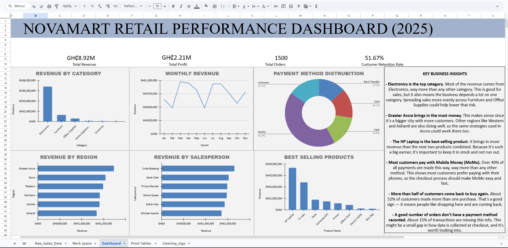

# 🛍️ NovaMart Retail Sales Analysis
## 📖 Project Overview

This project analyses retail sales data for NovaMart, a fictional retail company, using Google Sheets.

The objective was to clean raw sales data, perform exploratory data analysis (EDA), build an interactive dashboard, and generate business insights that can support better decision-making.

This project demonstrates a complete data analytics workflow from raw data to business recommendations.

## 🎯 Project Objectives

- Clean and prepare messy retail sales data
- Perform exploratory data analysis using Pivot Tables
- Build an interactive sales dashboard
- Identify sales trends and business opportunities
- Present actionable business insights and recommendations

  ## 🛠️ Tools Used

- Google Sheets
- Pivot Tables
- Charts
- Data Cleaning Techniques
- Dashboard Design
- GitHub
  
## 📂 Dataset

The dataset represents retail sales transactions from a fictional company, **NovaMart**. It was designed to simulate real-world retail operations and includes intentional data quality issues to demonstrate the data cleaning process.

### Dataset Summary

- **Rows:** 1,500
- **Columns:** 24
- **Time Period:** January – June 2025
- **Currency:** Ghana Cedi (GH₵)

### Key Fields

- Order ID
- Order Date
- Ship Date
- Customer Name
- Customer Age
- Gender
- City
- Region
- Store Branch
- Product Name
- Category
- Quantity
- Unit Price
- Revenue
- Profit
- Payment Method
- Customer Type
- Salesperson
- Returned
  ## 🧹 Data Cleaning

Before analysis, the dataset was cleaned to improve data quality.

### Data Quality Issues Identified

- Duplicate records
- Missing customer names
- Missing payment methods
- Invalid customer ages
- Inconsistent text formatting
- Ship dates occurring before order dates

### Cleaning Actions Performed

- Removed duplicate records
- Standardised text formatting (cities and payment methods)
- Replaced missing customer names with **"Unknown Customer"**
- Replaced missing payment methods with **"Unknown"**
- Cleared invalid age values greater than 100
- Flagged records where ship dates occurred before order dates
  
  ## 📊 Exploratory Data Analysis (EDA)

Pivot Tables were used to answer key business questions including:

- Which category generates the highest revenue?
- Which region performs best?
- Which products generate the most revenue?
- Which payment methods are most popular?
- Which salesperson generates the highest sales?
- What is the customer retention rate?
- What is the return rate?
## 🖼️ Dashboard Preview

Below is a preview of the final Google Sheets dashboard created for this project.

## 📌 Key Business Insights

- **Electronics** generated the highest revenue, significantly outperforming other product categories.
- **Greater Accra** recorded the highest regional sales, indicating a strong customer base.
- The **HP Laptop** was the highest revenue-generating product.
- **Mobile Money (MoMo)** was the preferred payment method, accounting for over 40% of all transactions.
- Approximately **52% of customers were returning customers**, indicating strong customer loyalty.
- Around **15% of transactions** had no recorded payment method, highlighting an opportunity to improve data collection.

  ## 💡 Business Recommendations

Based on the analysis, the following recommendations are proposed:

- Increase marketing efforts for Furniture and Office Supplies to diversify revenue sources.
- Apply successful sales strategies from Greater Accra to other regions.
- Maintain adequate inventory levels for the HP Laptop to avoid stock shortages.
- Continue improving the Mobile Money payment experience.
- Improve checkout procedures to ensure payment methods are consistently recorded.

  ## 🚀 Skills Demonstrated

- Data Cleaning
- Data Validation
- Exploratory Data Analysis (EDA)
- Pivot Tables
- Dashboard Design
- Data Visualization
- Business Analysis
- Spreadsheet Modeling
- Business Reporting

  ## 👨‍💻 About the Author

Hi, I'm **Steven Donkoh**, a BSc Physics (Computing) student at Kwame Nkrumah University of Science and Technology (KNUST) with a growing interest in Data Analytics.

I'm currently building practical projects in Google Sheets, SQL, Power BI, and Python while developing the skills needed to solve real-world business problems through data.

Feel free to connect with me and follow my journey as I continue to build my data analytics portfolio.

## 🔮 Future Improvements

- Recreate this analysis using SQL.
- Build an interactive Power BI dashboard.
- Perform advanced analysis using Python (Pandas and Matplotlib).
- Expand the dataset to include a full year of sales.
- Add predictive analytics and sales forecasting.
