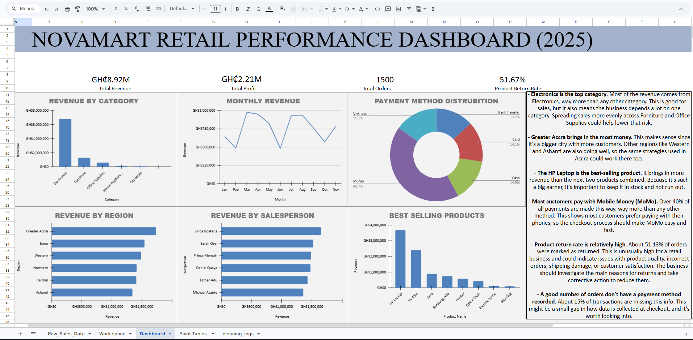

# 🛍️ NovaMart Retail & Logistics Analysis



## 📖 Project Overview

This project analyses retail sales and logistics data for **NovaMart**, a fictional retail company operating across Ghana.

The project was developed as a practical data analytics portfolio project, covering the complete workflow from raw data to business insights:

**Raw Data → Data Cleaning → Exploratory Analysis → SQL Analysis → Dashboard → Business Insights**

The analysis was initially performed using **Google Sheets/Excel** and later extended using **MySQL** to perform more advanced data analysis.

The objective was to transform messy transactional data into meaningful insights that could help a retail business understand its sales performance, customers, products, profitability and operations.

---

# 🎯 Project Objectives

The main objectives of this project were to:

- Clean and prepare messy retail sales data
- Identify and investigate data-quality issues
- Perform exploratory data analysis (EDA)
- Analyse revenue and profitability
- Identify high-performing products and categories
- Analyse customer purchasing behaviour
- Compare regional sales performance
- Analyse payment-method usage
- Evaluate product return rates
- Analyse shipping performance
- Identify high-value customers
- Analyse monthly revenue trends
- Calculate month-over-month revenue growth
- Build a business dashboard
- Generate actionable business recommendations

---

# 🗂️ Dataset

The dataset represents retail sales transactions from the fictional company NovaMart.

It was designed to simulate a realistic retail environment and intentionally contains several data-quality issues for analysis and cleaning practice.

### Dataset Summary

| Attribute | Description |
|---|---|
| Rows | 1,500 |
| Columns | 24 |
| Time Period | January – December 2025 |
| Currency | Ghana Cedi (GH₵) |
| Industry | Retail |

### Key Fields

- Order ID
- Order Date
- Ship Date
- Customer Name
- Customer Age
- Gender
- City
- Region
- Store Branch
- Product Name
- Category
- Quantity
- Unit Price
- Discount %
- Revenue
- Cost
- Profit
- Payment Method
- Customer Type
- Salesperson
- Returned
- Date Validity

---

# 🧹 Data Cleaning

Before performing the analysis, the raw dataset was inspected and cleaned using **Google Sheets/Excel**.

### Data Quality Issues Identified

- Duplicate records
- Missing customer names
- Missing payment methods
- Invalid customer ages
- Inconsistent text formatting
- Ship dates occurring before order dates
- Negative revenue values
- Negative cost values
- Negative profit values
- Returned transactions requiring investigation

### Cleaning Actions

The following cleaning steps were performed:

- Removed duplicate records
- Standardised text formatting
- Standardised city and payment-method values
- Replaced missing customer names with `Unknown Customer`
- Replaced missing payment methods with `Unknown`
- Cleared invalid age values greater than 100
- Flagged records where ship dates occurred before order dates
- Investigated negative revenue, cost and profit records
- Created data-validity checks for logistics analysis

The cleaned dataset was then used for the dashboard and SQL analysis.

---

# 📊 Exploratory Data Analysis

The initial analysis was performed using **Pivot Tables, formulas and charts** in Google Sheets/Excel.

The analysis explored questions such as:

- Which category generates the highest revenue?
- Which region performs best?
- Which products generate the most revenue?
- Which payment methods are most popular?
- Which salesperson generates the highest sales?
- What is the Average Order Value?
- Which customer type generates the most revenue?
- Which categories generate the highest profit?
- What is the return rate?
- Which branches have the longest shipping lead times?
- How is revenue distributed across different order sizes?

---

# 🗄️ SQL Analysis — MySQL

After completing the spreadsheet analysis, the project was extended using **MySQL**.

SQL was used to perform deeper analysis and answer more complex business questions.

### SQL Techniques Used

- `SELECT`
- `WHERE`
- `GROUP BY`
- `HAVING`
- `ORDER BY`
- `LIMIT`
- Aggregate functions
- `CASE WHEN`
- Subqueries
- Common Table Expressions (CTEs)
- `CROSS JOIN`
- `DATE_FORMAT()`
- `DATEDIFF()`
- Window functions
- `LAG()`
- `ROW_NUMBER()`
- `PARTITION BY`

### SQL Analysis Areas

#### Sales Performance
- Total revenue
- Monthly revenue
- Average Order Value
- Revenue by region
- Revenue by salesperson
- Revenue by customer type
- Month-over-month revenue growth

#### Product & Category Analysis
- Top products by revenue
- Highest-revenue category
- Products performing above average
- Top products within each category
- Categories generating more than GH₵1 million
- Category profitability
- Profit margins
- Discount and profitability analysis

#### Customer Analysis
- Customer spending
- Average customer spending
- Top 10 customers
- Customer revenue contribution
- High-value customers

#### Operations & Logistics
- Shipping lead time by store branch
- Product return rates
- Payment-method usage
- Revenue classification
- Data validity analysis

---

# 📈 Key Business Insights

## 1. Electronics dominated revenue

Electronics was the strongest-performing product category and generated substantially more revenue than the other categories.

This indicates that NovaMart's revenue is heavily concentrated in the Electronics category.

---

## 2. HP Laptop was the leading product

The **HP Laptop** was the highest revenue-generating product, generating approximately:

**GH₵3.67 million**

The **TV 43in** followed with approximately:

**GH₵2.38 million**

This shows that a small number of high-value products contribute significantly to NovaMart's overall revenue.

---

## 3. High-value orders generated most of the revenue

Orders were classified according to revenue:

| Order Classification | Orders | Revenue | % of Orders |
|---|---:|---:|---:|
| High | 506 | GH₵7,048,380 | 34.42% |
| Medium | 398 | GH₵1,411,205 | 27.08% |
| Low | 566 | GH₵452,475 | 38.50% |

Although High-value orders represented only **34.42% of orders**, they generated the majority of total revenue.

---

## 4. Greater Accra was the strongest region

Greater Accra recorded the highest regional revenue.

Western and Ashanti also showed strong sales performance.

This suggests that NovaMart has particularly strong demand in Greater Accra while other regions may provide opportunities for further growth.

---

## 5. Revenue was concentrated among top customers

The SQL analysis identified the highest-value customers based on total spending.

The top 10 customers were also analysed to determine how much of NovaMart's total revenue they contributed.

This provides an indication of the company's customer-revenue concentration and highlights the importance of understanding both high-value customers and the broader customer base.

---

## 6. Mobile Money was the most frequently used payment method

Mobile Money (MoMo) recorded the highest number of orders among the available payment methods.

This indicates that digital/mobile payments are an important part of NovaMart's customer purchasing behaviour.

The dataset also contained transactions with missing payment-method information, highlighting an opportunity to improve data collection.

---

## 7. Product returns require further investigation

The analysis identified relatively high return rates across several product categories.

Rather than assuming that returns are caused by product quality alone, NovaMart should investigate possible causes such as:

- Product defects
- Incorrect orders
- Delivery issues
- Customer expectations
- Product descriptions
- Order fulfilment errors

Understanding the reasons behind returns would allow the company to take more targeted action.

---

## 8. Shipping performance varied across branches

Shipping lead times differed between store branches.

Branches with longer average shipping times may require further investigation into:

- Inventory availability
- Order processing
- Transportation
- Distribution efficiency
- Regional logistics

---

# 💡 Business Recommendations

Based on the analysis, the following recommendations were identified:

### 1. Reduce dependence on Electronics

NovaMart should explore opportunities to strengthen Furniture, Office Supplies, Home Appliances and other categories to create a more balanced revenue mix.

### 2. Monitor high-performing products

Products such as the HP Laptop and TV 43in contribute substantially to revenue.

NovaMart should closely monitor their inventory levels and sales performance.

### 3. Investigate product returns

The high return rates identified in the analysis should be investigated to determine their underlying causes.

### 4. Strengthen high-value customer relationships

Customers generating substantial revenue should be monitored through customer segmentation and retention analysis.

At the same time, NovaMart should continue developing its wider customer base.

### 5. Improve payment-method data collection

Missing payment-method records reduce the accuracy of payment analysis.

The checkout process should ensure that payment information is captured consistently.

### 6. Improve logistics performance

Store branches with longer shipping lead times should be investigated to identify opportunities to improve order processing and delivery efficiency.

### 7. Expand regional performance

NovaMart can investigate the factors driving strong performance in Greater Accra and determine whether similar strategies can be applied appropriately in other regions.

---

# 📊 Dashboard

An interactive retail sales dashboard was created using **Google Sheets/Excel**.

The dashboard provides a visual overview of:

- Revenue
- Profit
- Sales by category
- Product performance
- Regional performance
- Monthly sales
- Customer behaviour
- Payment methods
- Returns
- Other key business metrics

The dashboard is included in the `Dashbords` folder.

---

# 🛠️ Tools & Technologies

### Data Analysis

- Microsoft Excel
- Google Sheets
- MySQL
- SQL

### Data Visualisation

- Excel/Google Sheets Charts
- Pivot Tables
- Interactive Dashboard

### Version Control & Portfolio

- GitHub

---

# 🧠 Skills Demonstrated

- Data Cleaning
- Data Validation
- Exploratory Data Analysis
- SQL Data Analysis
- Aggregate Functions
- Subqueries
- Common Table Expressions
- Window Functions
- Customer Analysis
- Product Analysis
- Revenue Analysis
- Profitability Analysis
- Data Visualisation
- Dashboard Design
- Business Analysis
- Business Reporting
- Spreadsheet Modelling
- Data Storytelling

---

# 👨‍💻 About the Author

Hi, I'm Steven Donkoh, a BSc Physics (Computing) student at Kwame Nkrumah University of Science and Technology (KNUST) with a growing interest in Data Analytics.

I'm currently building practical projects in:

Excel
Google Sheets
SQL
Power BI
Python

My goal is to develop strong technical and analytical skills that allow me to solve real-world business problems using data.

This NovaMart project represents one of my practical projects as I continue building my data analytics portfolio.

---

# 🚀 Future Improvements

The project can be extended further by:

Building an interactive Power BI dashboard
Performing advanced analysis using Python
Using Pandas for data manipulation
Using Matplotlib for visualisation
Expanding the dataset beyond the current six-month period
Performing customer segmentation
Adding sales forecasting
Performing predictive analytics
Analysing customer churn and retention
Building automated reporting

---
# 📌 Conclusion

The NovaMart Retail & Logistics Analysis demonstrates a complete data analytics workflow, from raw and imperfect data to cleaned datasets, SQL analysis, visualisation and business recommendations.

The project demonstrates the practical application of Excel/Google Sheets and MySQL to investigate sales performance, product performance, customer behaviour and operational efficiency.

It also demonstrates how technical analysis can be translated into business insights that can support decision-making.

---
# ⭐ Project Highlights

Dataset: 1,500 retail transactions
Period: January – December 2025
Currency: Ghana Cedi (GH₵)
Tools: Excel, Google Sheets, MySQL, SQL, GitHub
Focus: Retail Sales, Customer Analysis, Product Performance, Profitability & Logistics

# 📁 Repository Structure

```text
NovaMart-Retail-Sales-Analysis/
│
├── README.md
│
├── Data/
│   ├── NovaMart_Retail_Raw_Sales_Dataset.xlsx
│   └── NovaMart_Retail_Cleaned_Sales_Dataset.xlsx
│
├── sql/
│   └── NovaMart_Retail_Analysis.sql
│
├── results/
│   └── NovaMart_portfolio_Result.csv
│
└── Dashbords/
    ├── NovaMart_Dashboard.xlsx
    ├── NovaMart_Sales_Dashboard.pdf
    └── Dashboardd.png


---
